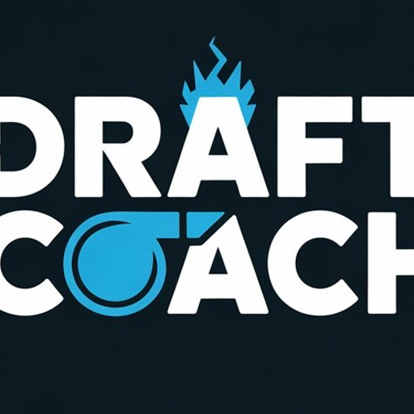

<p align="center">
  
  <h1 align="center">DraftCoach</h1>
  <p align="center">
    <strong>AI-powered League of Legends draft assistant with real-time build recommendations</strong>
  </p>
  <p align="center">
    
    
    
    
  </p>
</p>

---

## What is DraftCoach?

DraftCoach is a desktop companion app for League of Legends that generates **optimized builds tailored to your exact draft**. Unlike static tier lists, DraftCoach uses **Google Gemini AI with Search Grounding** to analyze your champion, role, allies, and enemies — then produces a complete build plan verified against live patch data.

### Key Features

- 🧠 **AI-Grounded Builds** — Gemini 3.1 Pro with Google Search grounding ensures recommendations reflect the current meta, not stale training data
- 🎮 **In-Game Export** — One-click export to League's Item Sets tab. Your build appears directly in the shop during the game
- 🖼️ **Full DDragon Integration** — Champion portraits, item icons, rune icons, spell icons, and stat shard images pulled from Riot's official CDN
- ⚡ **Draft-Aware** — Input your allies and enemies to get comp-specific itemization (anti-tank, anti-burst, etc.)
- 💾 **Smart Caching** — Builds cached for 24h with stale-cache fallback if the API is unreachable
- 🔄 **Retry Logic** — Exponential backoff with 3 attempts + NEED_RETRY detection for unreliable AI responses
- 🎨 **Dark Theme UI** — Clean, League-inspired dark interface with gold accents

---

## Screenshots

> *Coming soon*

---

## Architecture

```
DraftCoach/
├── apps/
│   ├── desktop/          # Electron + React frontend
│   │   ├── src/
│   │   │   ├── main/     # Electron main process (embedded Express backend)
│   │   │   └── renderer/ # React UI (ChampionPicker, BuildOutput, etc.)
│   │   └── dist/         # Webpack production bundle
│   └── backend/          # Standalone Express backend (for development)
│       └── src/
│           ├── routes/    # /api/build, /api/version
│           └── services/  # Gemini AI, DDragon, file cache
└── shared/               # Shared TypeScript types
```

**Production:** The Electron main process embeds a full Express server — no separate backend process needed. The renderer communicates with `http://127.0.0.1:3210`.

**Development:** Backend runs standalone (`npm run dev` in `apps/backend`), desktop connects to it via the same port.

---

## Build Sections

Each generated build includes:

| Section | Description |
|---------|-------------|
| **Runes** | Primary tree + keystone, secondary tree, stat shards — with icons |
| **Summoner Spells** | Optimal spells for role and matchup |
| **Skill Order** | Priority leveling (e.g. R > Q > W > E) |
| **Starting Items** | Opening purchase with reasoning |
| **Core Build** | 6 items (7 for ADC — Season 2026 has 7 item slots for bot lane) with explanations |
| **Situational Items** | 4+ conditional swaps with buy conditions |

---

## In-Game Item Set Export

Click **🎮 Export to LoL** and the build appears in-game under the **Item Sets** tab in the shop:

1. DraftCoach writes a `DraftCoach.json` file to `<LoL Install>/Config/Champions/<Champion>/Recommended/`
2. Auto-detects League install path (C:\, D:\ common locations)
3. Sections: Starting Items → Core Build → Situational
4. Works immediately — no game restart needed (open/close shop to refresh)

---

## Setup

### Prerequisites

- **Node.js** 18+
- **Gemini API Key** with Google Search grounding enabled ([Get one here](https://aistudio.google.com/))

### Installation

```bash
git clone https://github.com/Sliv3er/DraftCoach.git
cd DraftCoach

# Install dependencies
cd apps/backend && npm install && cd ../..
cd apps/desktop && npm install && cd ../..

# Configure API key
cp .env.example .env
# Edit .env and add your GEMINI_API_KEY
```

### Development

```bash
# Terminal 1: Start backend
cd apps/backend && npm run dev

# Terminal 2: Start desktop (webpack dev server + electron)
cd apps/desktop && npm run dev
```

### Production Build

```bash
cd apps/desktop

# Build renderer
npx webpack --mode production

# Build Electron app (unpacked)
npx electron-builder --dir

# Output: dist-electron/win-unpacked/DraftCoach.exe
```

### Configuration

| Variable | Default | Description |
|----------|---------|-------------|
| `GEMINI_API_KEY` | *(required)* | Google Gemini API key |
| `GEMINI_MODEL` | `gemini-3.1-pro-preview` | AI model (must support grounding) |
| `BACKEND_PORT` | `3210` | Local backend port |

In production, `.env` is loaded from (in order): `%APPDATA%/DraftCoach/`, next to the `.exe`, or the `resources/` folder.

---

## Tech Stack

| Layer | Technology |
|-------|-----------|
| Desktop | Electron 28 |
| Frontend | React 18 + TypeScript |
| Backend | Express (embedded in main process) |
| AI | Google Gemini 3.1 Pro with Search Grounding |
| Build | Webpack 5 + electron-builder |
| Data | Riot DDragon CDN + CommunityDragon |

---

## Roadmap

- [ ] Auto-detect champ select via League Client API (LCU)
- [ ] Rune page auto-import
- [ ] Match history analysis
- [ ] Multi-language support
- [ ] macOS / Linux builds
- [ ] App icon and installer

---

## License

MIT

---

<p align="center">
  <sub>Built with Gemini AI • Not endorsed by Riot Games • League of Legends is a trademark of Riot Games, Inc.</sub>
</p>
