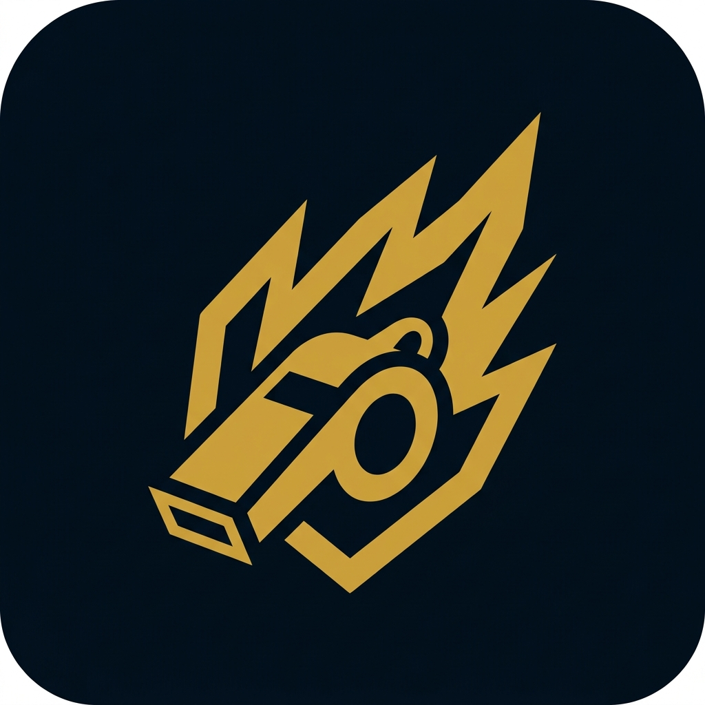

<p align="center">
  
  <h1 align="center">DraftCoach</h1>
  <p align="center">
    <strong>AI-powered League of Legends companion — real-time builds, live scouting, cooldown tracking, and performance analytics</strong>
  </p>
  <p align="center">
    
    
    
    
    
  </p>
</p>

---

## What is DraftCoach?

DraftCoach is a full-featured desktop companion for League of Legends that goes far beyond simple build recommendations. It connects to the League Client and Live Game APIs to provide **real-time intelligence** throughout every phase of the game — from champion select to post-game analysis.

Unlike static tier lists or basic build sites, DraftCoach uses **Google Gemini AI with Search Grounding** to analyze your draft, scout your opponents, track enemy cooldowns, and adapt your build live during the game.

---

## ✨ Features

### 🧠 AI-Grounded Builds
- **Draft-aware build generation** — input your champion, role, allies, and enemies to get comp-specific itemization
- **Gemini 3.1 Pro with Google Search Grounding** ensures recommendations reflect the current meta
- Complete builds: runes, summoner spells, skill order, starting items, core build (6-7 items), and situationals
- **Local Decision Engine** — instant (<30ms) build recommendations from a rules-based knowledge base, with AI fallback

### 🎮 In-Game Overlay
- **Transparent HUD overlay** that sits on top of the game
- **Next Item Tracker** — shows what to buy next with gold tracking and "READY TO BUY" alerts
- **Component breakdown** — see which component to purchase when you can't afford the full item
- **Build progress strip** — visual checklist of your entire build order
- **Jungle path overlay** — numbered route displayed directly on the minimap for junglers

### 🔍 Live Scouting (Pre-Game)
- **Auto-generated scout reports** during loading screen via Riot API
- Player ranks (Solo/Duo + Flex), win rates, recent match history, and KDA
- **Threat ratings** (1-10) for each enemy with AI-generated notes
- **Smurf detection** and **mental state analysis** (ON FIRE / TILTED / etc.)
- **Lane matchup breakdown** — early game assessment, power spikes, play tips, and danger windows
- **Team strategy** — win condition, focus targets, avoid targets, and objective priority
- **Win probability** estimate

### ⏱️ Cooldown Tracker
- **Click-to-track** enemy summoner spells and ultimates from the scoreboard
- **Real-time countdown** with sweep animation on spell icons
- Cooldowns account for **Cosmic Insight**, **Ionian Boots**, and **Summoner Spell Haste** items
- **Overlay integration** — active timers appear as a strip on the in-game HUD
- **Tracker panel** — compact side panel for quick cooldown monitoring

### 📊 Live Scoreboard
- **Real-time scoreboard window** with all 10 players' KDA, items, CS, and levels
- Click enemy champion portraits to track their ultimate cooldown
- Click enemy summoner spells to start cooldown timers
- **Kill score** and game timer displayed in the title bar

### 📈 Performance Stats
- **Personal stats dashboard** powered by Riot API — rank, LP, win rate, champion pool
- **LP progress chart** — interactive graph tracking Solo/Duo and Flex LP over 7d/30d
- **Match history** with expandable scoreboards, per-game DPM bars, and KP stats
- **AI performance analysis** — queue health, consistency grade, mental state, improvement areas
- **Per-champion ratings** with AI-generated grades and notes
- **Mode filtering** — filter by Ranked, Flex, ARAM, Draft, or Normal
- **Player profile lookup** — click any player name in match history to view their stats
- **LP prediction** — estimated games to promotion based on current win rate

### 🔄 Live Advisor (Mid-Game)
- **Real-time build adaptation** during the game via Gemini Flash
- Monitors enemy items, KDA, and gold to suggest build pivots
- Identifies **fed threats** and recommends counters
- Suggests **next purchase** based on current game state, not just the pre-game plan

### 📦 In-Game Item Set & Rune Export
- **One-click item set export** — writes directly to League's item sets folder
- Auto-detects League install path across common locations
- **Rune page auto-import** via LCU API — creates/updates a DraftCoach rune page directly in the client

### 🔌 League Client Integration (LCU)
- **WebSocket connection** to the League Client for instant champ select updates
- **Exponential backoff reconnect** (0.5s → 8s max) with polling fallback
- **Status indicator** — connected / disconnected / reconnecting
- Auto-detects lockfile from common installation paths

### 🗃️ Knowledge Base System
- **Structured KB** with champion data, build templates, matchups, synergies, and scoring weights
- **Hot-reload** — file watcher auto-reloads KB when JSON files change
- **Atomic updates** with archive and rollback support for patch transitions
- **Validation pipeline** — validates all KB files before loading with detailed error reporting
- **Meta-builder CLI** — generates champion/item data from DDragon + CommunityDragon

---

## Architecture

```
DraftCoach/
├── apps/
│   ├── desktop/                  # Electron + React frontend
│   │   ├── src/
│   │   │   ├── main/
│   │   │   │   ├── main.js       # Electron main process (embedded Express + LCU + overlay)
│   │   │   │   ├── engine-js.js  # Local decision engine bridge
│   │   │   │   ├── settings.js   # User settings persistence
│   │   │   │   ├── crash-logger.js
│   │   │   │   └── cooldowns/    # Cooldown timer manager
│   │   │   └── renderer/
│   │   │       ├── App.tsx           # Main React app (build UI, champion picker)
│   │   │       ├── Overlay.tsx       # In-game transparent HUD overlay
│   │   │       ├── ScoreboardWindow.tsx  # Live scoreboard with cooldown tracking
│   │   │       ├── ScoutWindow.tsx   # Pre-game scouting report
│   │   │       ├── StatsWindow.tsx   # Performance analytics dashboard
│   │   │       ├── TrackerPanel.tsx   # Compact cooldown tracker
│   │   │       ├── components/
│   │   │       │   └── BuildOutput.tsx  # Build display with runes, items, spells
│   │   │       ├── validateBuild.ts  # Build validation logic
│   │   │       └── styles.css        # All UI styles (dark theme)
│   │   └── dist/                 # Webpack production bundle
│   └── backend/                  # Express backend (embedded in production)
│       └── src/
│           ├── routes/
│           │   └── build.ts      # /api/build, /api/version, /api/stats
│           └── services/
│               ├── gemini.ts     # Gemini AI integration
│               ├── live-advisor.ts   # Real-time build advisor (Gemini Flash)
│               ├── rag-updater.ts    # RAG context updater
│               ├── stats.ts      # Player stats service
│               ├── ddragon.ts    # DDragon version fetcher
│               └── cache.ts      # File-based response cache
├── shared/                       # Shared TypeScript modules
│   ├── engine/                   # Local decision engine (<30ms builds)
│   │   ├── engine.ts             # Main orchestrator
│   │   ├── scoring.ts            # Multi-factor item/rune scoring
│   │   ├── resolver.ts           # Item/rune resolver from KB
│   │   ├── rule-engine.ts        # Triggered rules system
│   │   ├── rules.ts              # Rule definitions
│   │   ├── comp-profiler.ts      # Team composition profiler
│   │   └── explainer.ts          # Human-readable explanation generator
│   ├── kb/                       # Knowledge Base system
│   │   ├── kb-loader.ts          # KB data loader
│   │   ├── kb-manager.ts         # Lifecycle manager (hot-reload, rollback)
│   │   ├── kb-validator.ts       # Validation pipeline
│   │   └── data/                 # Champion, item, matchup JSON files
│   ├── lcu/
│   │   └── lcu-adapter.ts        # League Client WebSocket adapter
│   ├── export/
│   │   └── rune-export.ts        # Rune page LCU export
│   ├── cooldowns/
│   │   └── cooldown-data.js      # Summoner spell & ult cooldown database
│   ├── types.ts                  # Shared type definitions
│   └── engine-types.ts           # Engine-specific types
└── tools/
    ├── generate-champions.js     # DDragon champion data scraper
    ├── generate-items.js         # DDragon item data scraper
    └── meta-builder/             # KB builder CLI (generate, validate, deep-gen)
```

**Production:** The Electron main process embeds a full Express server — no separate backend process needed. The renderer communicates with `http://127.0.0.1:3210`.

**Development:** Backend runs standalone, desktop connects to it via the same port.

---

## Build Sections

Each generated build includes:

| Section | Description |
|---------|-------------|
| **Runes** | Primary tree + keystone, secondary tree, stat shards — with icons |
| **Summoner Spells** | Optimal spells for role and matchup |
| **Skill Order** | Priority leveling (e.g. R > Q > W > E) |
| **Starting Items** | Opening purchase with reasoning |
| **Core Build** | 6-7 items with explanations |
| **Situational Items** | 4+ conditional swaps with buy conditions |
| **Jungle Path** | Optimized clear route for junglers (displayed on minimap overlay) |

---

## Setup

### Prerequisites

- **Node.js** 18+
- **Gemini API Key** with Google Search grounding enabled ([Get one here](https://aistudio.google.com/))

### Installation

```bash
git clone https://github.com/Sliv3er/DraftCoach.git
cd DraftCoach

# Install all dependencies
npm install

# Configure API key
cp .env.example .env
# Edit .env and add your GEMINI_API_KEY
```

### Development

```bash
# Start desktop app (webpack dev server + Electron)
npm run dev

# Or run backend standalone
cd apps/backend && npm run dev
```

### Production Build

```bash
# Build everything + package Electron app
npm run build:desktop

# Output: apps/desktop/dist-electron/win-unpacked/DraftCoach.exe
```

### Running Tests

```bash
# Run engine unit tests
npm test

# Run engine-only tests
npm run test:engine

# Validate Knowledge Base
npm run validate:kb
```

### Configuration

| Variable | Default | Description |
|----------|---------|-------------|
| `GEMINI_API_KEY` | *(required)* | Google Gemini API key |
| `GEMINI_MODEL` | `gemini-3.1-pro-preview` | AI model for builds (must support grounding) |
| `BACKEND_PORT` | `3210` | Local backend port |

In production, `.env` is loaded from (in order): `%APPDATA%/DraftCoach/`, next to the `.exe`, or the `resources/` folder.

---

## Tech Stack

| Layer | Technology |
|-------|-----------|
| Desktop | Electron 28 |
| Frontend | React 18 + TypeScript |
| Backend | Express (embedded in main process) |
| AI (Builds) | Google Gemini 3.1 Pro with Search Grounding |
| AI (Live) | Google Gemini 3 Flash (real-time advisor) |
| Local Engine | Custom rules-based scoring engine (<30ms) |
| Build | Webpack 5 + electron-builder |
| Data | Riot DDragon CDN + CommunityDragon |
| Client API | League Client Update (LCU) WebSocket |
| Game API | Riot Live Client Data API |
| Testing | Jest + ts-jest |

---

## Roadmap

- [x] ~~Auto-detect champ select via League Client API (LCU)~~ ✅
- [x] ~~Rune page auto-import~~ ✅
- [x] ~~In-game overlay~~ ✅
- [x] ~~Live cooldown tracking~~ ✅
- [x] ~~Player scouting~~ ✅
- [x] ~~Performance stats dashboard~~ ✅
- [x] ~~Local decision engine~~ ✅
- [x] ~~Live build advisor~~ ✅
- [x] ~~App icon and installer~~ ✅
- [ ] Match history analysis with AI coaching
- [ ] Multi-language support
- [ ] macOS / Linux builds
- [ ] Auto-updater

---

## License

MIT

---

<p align="center">
  <sub>Built with Gemini AI • Not endorsed by Riot Games • League of Legends is a trademark of Riot Games, Inc.</sub>
</p>
